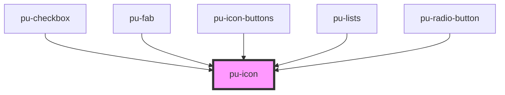

# pu-icon

<!-- Auto Generated Below -->

## Properties

| Property | Attribute | Description | Type                     | Default      |
| -------- | --------- | ----------- | ------------------------ | ------------ |
| `type`   | `type`    |             | `"filled" \| "outlined"` | `'outlined'` |

## Dependencies

### Used by

 - [pu-checkbox](../pu-checkbox)
 - [pu-fab](../pu-fab)
 - [pu-icon-buttons](../pu-icon-buttons)
 - [pu-lists](../pu-lists)
 - [pu-radio-button](../pu-radio-button)

### Graph

----------------------------------------------

*Built with [StencilJS](https://stenciljs.com/)*
