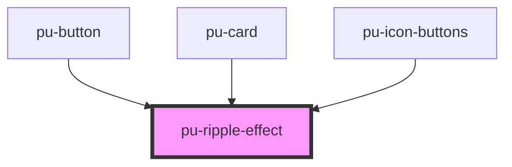

# pu-ripple-effect

<!-- Auto Generated Below -->

## Dependencies

### Used by

 - [pu-button](../pu-button)
 - [pu-card](../pu-card)
 - [pu-icon-buttons](../pu-icon-buttons)

### Graph

----------------------------------------------

*Built with [StencilJS](https://stenciljs.com/)*
