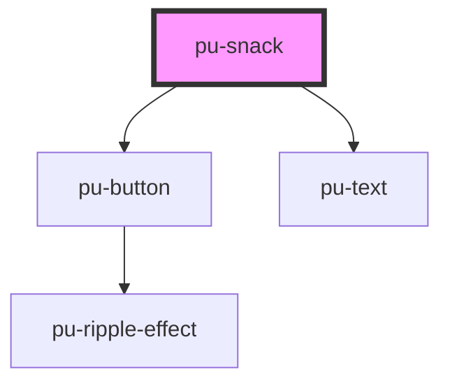

# pu-snack

<!-- Auto Generated Below -->

## Properties

| Property    | Attribute    | Description | Type     | Default     |
| ----------- | ------------ | ----------- | -------- | ----------- |
| `titleMain` | `title-main` |             | `string` | `undefined` |

## Dependencies

### Depends on

- [pu-button](../pu-button)
- [pu-text](../pu-text)

### Graph

----------------------------------------------

*Built with [StencilJS](https://stenciljs.com/)*
