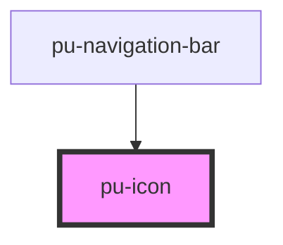

# pu-icon

<!-- Auto Generated Below -->

## Properties

| Property | Attribute | Description | Type                     | Default    |
| -------- | --------- | ----------- | ------------------------ | ---------- |
| `fill`   | `fill`    |             | `"filled" \| "outlined"` | `'filled'` |

## Dependencies

### Used by

 - [pu-navigation-bar](../navigation-bar)

### Graph

----------------------------------------------

*Built with [StencilJS](https://stenciljs.com/)*
