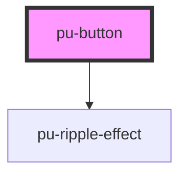

# pu-button

<!-- Auto Generated Below -->

## Properties

| Property   | Attribute  | Description | Type                                                               | Default      |
| ---------- | ---------- | ----------- | ------------------------------------------------------------------ | ------------ |
| `disabled` | `disabled` |             | `boolean`                                                          | `undefined`  |
| `type`     | `type`     |             | `"elevated" \| "filled" \| "filled-tonal" \| "outlined" \| "text"` | `'elevated'` |

## Dependencies

### Depends on

- [pu-ripple-effect](../pu-ripple-effect)

### Graph

----------------------------------------------

*Built with [StencilJS](https://stenciljs.com/)*
