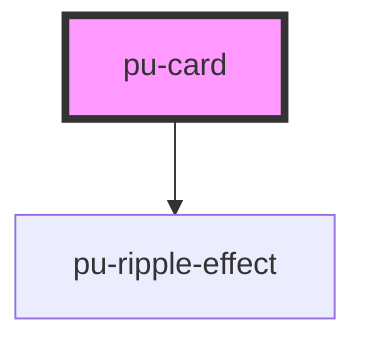

# pu-card

<!-- Auto Generated Below -->

## Properties

| Property   | Attribute  | Description | Type                                   | Default      |
| ---------- | ---------- | ----------- | -------------------------------------- | ------------ |
| `disabled` | `disabled` |             | `boolean`                              | `false`      |
| `type`     | `type`     |             | `"elevated" \| "filled" \| "outlined"` | `'elevated'` |

## Dependencies

### Depends on

- [pu-ripple-effect](../pu-ripple-effect)

### Graph

----------------------------------------------

*Built with [StencilJS](https://stenciljs.com/)*
