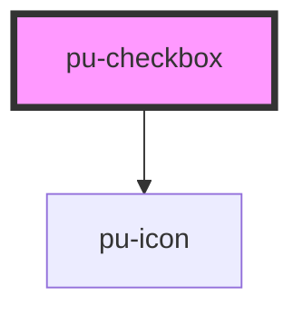

# pu-checkbox

<!-- Auto Generated Below -->

## Properties

| Property   | Attribute   | Description | Type      | Default |
| ---------- | ----------- | ----------- | --------- | ------- |
| `disabled` | `disabled`  |             | `boolean` | `false` |
| `hasError` | `has-error` |             | `boolean` | `false` |

## Dependencies

### Depends on

- [pu-icon](../pu-icon)

### Graph

----------------------------------------------

*Built with [StencilJS](https://stenciljs.com/)*
