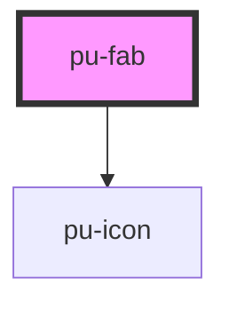

# pu-fab

<!-- Auto Generated Below -->

## Properties

| Property   | Attribute  | Description | Type                                                                       | Default      |
| ---------- | ---------- | ----------- | -------------------------------------------------------------------------- | ------------ |
| `color`    | `color`    |             | `"color" \| "primary" \| "secondary" \| "surface" \| "tertiary" \| "text"` | `'color'`    |
| `disabled` | `disabled` |             | `boolean`                                                                  | `false`      |
| `icon`     | `icon`     |             | `string`                                                                   | `undefined`  |
| `type`     | `type`     |             | `"add" \| "elevated" \| "large" \| "small" \| "text"`                      | `'elevated'` |

## Dependencies

### Depends on

- [pu-icon](../pu-icon)

### Graph

----------------------------------------------

*Built with [StencilJS](https://stenciljs.com/)*
