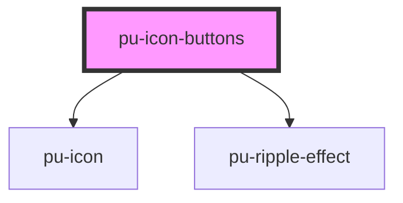

# pu-icon-buttons

<!-- Auto Generated Below -->

## Properties

| Property   | Attribute  | Description | Type                        | Default      |
| ---------- | ---------- | ----------- | --------------------------- | ------------ |
| `disabled` | `disabled` |             | `boolean`                   | `false`      |
| `tooltip`  | `tooltip`  |             | `string`                    | `undefined`  |
| `type`     | `type`     |             | `"contained" \| "standart"` | `'standart'` |

## Dependencies

### Depends on

- [pu-icon](../pu-icon)
- [pu-ripple-effect](../pu-ripple-effect)

### Graph

----------------------------------------------

*Built with [StencilJS](https://stenciljs.com/)*
