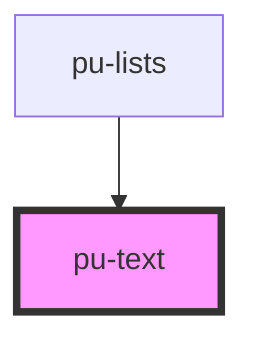

# pu-text

<!-- Auto Generated Below -->

## Properties

| Property | Attribute | Description | Type                                                                                                                                                                                                                                                                                                                   | Default       |
| -------- | --------- | ----------- | ---------------------------------------------------------------------------------------------------------------------------------------------------------------------------------------------------------------------------------------------------------------------------------------------------------------------- | ------------- |
| `type`   | `type`    |             | `"body-text" \| "body-text-large" \| "body-text-small" \| "display-text" \| "display-text-large" \| "display-text-small" \| "headline-text" \| "headline-text-large" \| "headline-text-small" \| "label-text" \| "label-text-large" \| "label-text-small" \| "title-text" \| "title-text-large" \| "title-text-small"` | `'body-text'` |

## Dependencies

### Used by

 - [pu-lists](../pu-lists)

### Graph

----------------------------------------------

*Built with [StencilJS](https://stenciljs.com/)*
